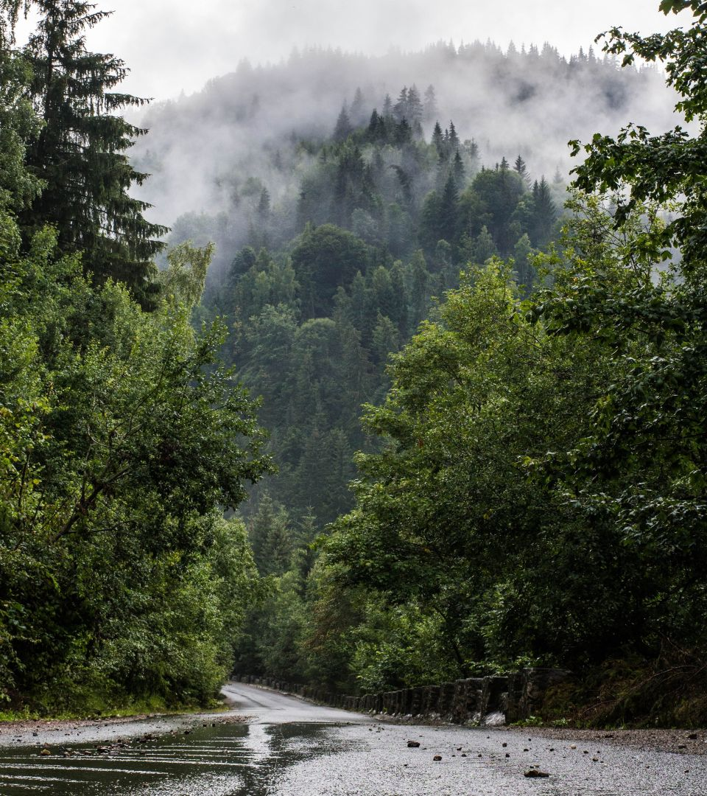
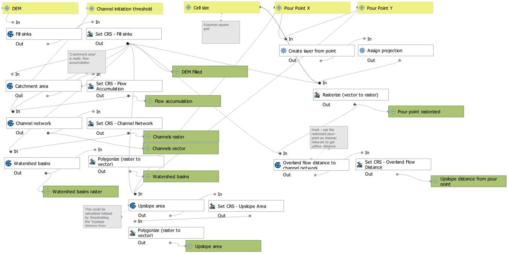
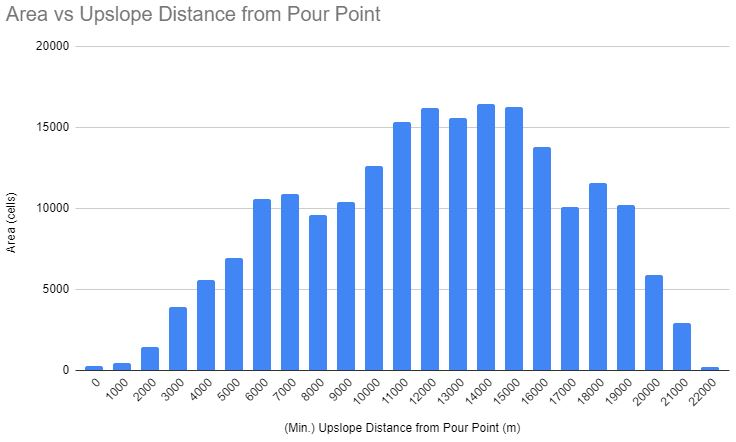
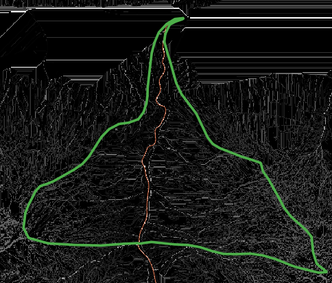

<section class="banner style1 orient-right fullscreen">

# Surface Runoff
## Methods in Spatial Analysis
## Assignment #5

Luke McQuade, January 2022

</section>

<section class="banner style1 orient-left content-align-left image-position-center onscroll-content-fade-in onscroll-image-fade-in fullscreen">

## Introduction
The [previous assignment][Asgmnt_Terrain] covered some terrain analysis around the town of Mittersill, Salzburg, where the river Felber meets the Salzach.

Here, some basic hydrological analysis of the area is performed, using [QGIS](TODO) and the integrated [SAGA](QGIS_SAGA) tools.

*If any of these hydrology terms are not familiar, the Stream Sense ['What Is A Catchment'][NZ_Guide] from Waikato Regional Council, New Zealand, seems to be a great guide.*

Per the [exercise guidance][Ex], the task is to create a rough flow model based on the upslope distance for the given pour point, i.e. rainfall at equal upslope distances reaches the outflow at the same time. Based on its distribution, an approximate unit hydrograph can be created.

## Method
The main steps involved in creating this type of flow model are:
1. Preprocess the DEM by sink-filling.
2. Generate a flow accumulation surface.
3. Create a channel network and basins.
4. Calculate a surface of the upslope distance from pour point.

A [hydrology QGIS tutorial][QGIS_Hydro] is available, which covers most of these steps. Please refer to this for details on steps 1 to 3. 

The [D8][D8] flow direction algorithm was used throughout.

### Calculating upslope distance from pour point
There doesn't seem to be a tool in QGIS explictly designed for this, but it can be achieved with an unconventional use of the [*Overland flow distance to channel network*][SAGA_OverlandFlow] operation. This expects a channel network raster layer to be fed into it. Instead, create a single pixel raster of the pour point, and use that in its place.

### Topo-flow Model
The QGIS ModelBuilder was used to develop a repeatable workflow of calculating the flow model, named 'Topo-flow'.

📷 *A screenshot of the model. The model is saved in the [QGIS project](#QGIS-project).*

### Further processing
Once the upslope distance surface had been created, which was continuous over the range 0 to ~22000m, it was binned by 1000m, and area zones were created from the binned surface. These zones correspond to the bins in the unit hydrograph.  

## Results

The 

TODO: explain

### Q: *What are the most critical zones in the catchment area, and how might land cover/use decisions influence the risk of floods?*

### Q: *What are some of the limitations of this model?*
* No groundwater
* No slope, land cover
* The larger the area, the less reliable (uniform rainfall) 

### DEM selection
Salzburg has freely available digital terrain models (DTMs) of the entire state down to 1m resolution. Initially a DTM of 5m meters was chosen. However, this seemed to be *too* fine - the  tools model channels as single-cell-width (raster) and lines (vector), and in reality the streams in the study area were wider than this.  
  
📷*This resulted in multiple channels for the same feature, and a confusing stream network and results of subsequent calculations.*

Resampling the DEM to 20m gave much better results.

### Study area
You will notice from the map the irregular shape of the study area. This is due to the DEM being avaialble for the state of Salzburg, and so the study area follows the state boundaries present in this relatively narrow part of the state. While state boundaries are often along ridges, that does not necessarily divide the watershed (see, for example, some of the [Argentina-Chile border disputes][ArgChile]). For a more accurate assessment, the DEM should be patched with data from the surrounding areas.  

### Pour point
Conceptually, the pour point would be at the confluence of the Felber and Salzach. But, here it is placed on the Felber slightly upstream of where they meet. The reason for this is that the upslope area would otherwise include the catchment of the Salzach also.  
  
📷 *Remember, this point is rasterized to a grid cell - keep in mind the cell size, and that it doesn't fall into the same cell as the actual confluence.*

### Q: *What is the significance of the channel initiation threshold?*
The channel initiation threshold is probably the most important parameter of the model. It is the value of flow accumulation at which a cell is designated a channel/stream,
and this determines the stream network and sub-basin structure. It is not a straight-forward parameter to 'guess' - it depends on the cell size, terrain, study area and use case.
You can see the resultant stream network and sub-basins for a variety of values on the map (1, 2 and 5 million), as well as 'ground-truth' state-provided survey layers for comparison. The area zones were calculated based on an initiation of 5M. Looking again at the survey layers for comparison, it seems a smaller threshold would have been more appropriate. 

### Q: *What are the effects if the 'Fill sinks' step is not performed?*
The fill sinks step guarantees there is a continuous, downslope path for every cell in an area. Without this, it would result in a patchy, disconnected stream network.
None of the subsequent calculations would then make sense.

    <iframe src="map/index.html"></iframe>

</section>

## Notes

## Tips
Here are some tips should you wish to attempt something similar.

### QGIS
* The tools often don't communicate problems very clearly, i.e. silent fails. Often this is due to an issue with the input data or parameters*, but use the latest LTS version of QGIS to rule out major software bugs. (I started out with v3.20, and then moved back to v3.16.)
* *Check the default values make sense for your input, e.g. cell size 'Not Set' (meaning 'guess from input') vs 0.0.
* For similar reasons, when using the model builder, don't try do too much at once - test frequently.

### qgis2web
[qgis2web](TODO) was used to create the above Leaflet map. I was *very* happy with the results. But, I encountered some issues:
* It doesn't support layer grouping (See issue [#989](https://github.com/tomchadwin/qgis2web/issues/989)).
* The rendering of composite styles (patterns etc.) is hit and miss.
* It was pretty unstable - 50% of the time it would fail to export or preview, with error `AttributeError: 'QgsFillSymbol' object has no attribute 'width'`. This would put QGIS in an unstable state - it would look like it was hanging, and that a restart was needed. But, you can still operate it, despite the cursor saying otherwise, and attempt exporting again without losing your settings. Will follow up on this issue when possible.

### General
TODO

## Resources

### QGIS Project
TODO

[Asgmnt_Terrain]: https://storymaps.arcgis.com/stories/ddce6eed1f314759a852f629656dbdf8
[Ex]: https://zgis.maps.arcgis.com/apps/MapJournal/index.html?appid=9c54cf4d43e240d983470fd961de7cb2
[D8]: https://rivix.com/Topics/D8_vs_Dinf.php
[NZ_Guide]: https://www.waikatoregion.govt.nz/assets/WRC/WRC-2019/stream-sense-understanding.pdf
[QGIS_Hydro]:https://docs.qgis.org/3.16/en/docs/training_manual/processing/hydro.html
[SAGA_QGIS]: https://docs.qgis.org/3.16/en/docs/training_manual/processing/first_saga_alg.html
[SAGA_OverlandFlow]: http://www.saga-gis.org/saga_tool_doc/2.3.0/ta_channels_4.html
[ArgChile]:https://en.wikipedia.org/wiki/Boundary_Treaty_of_1881_between_Chile_and_Argentina#Further_disputes