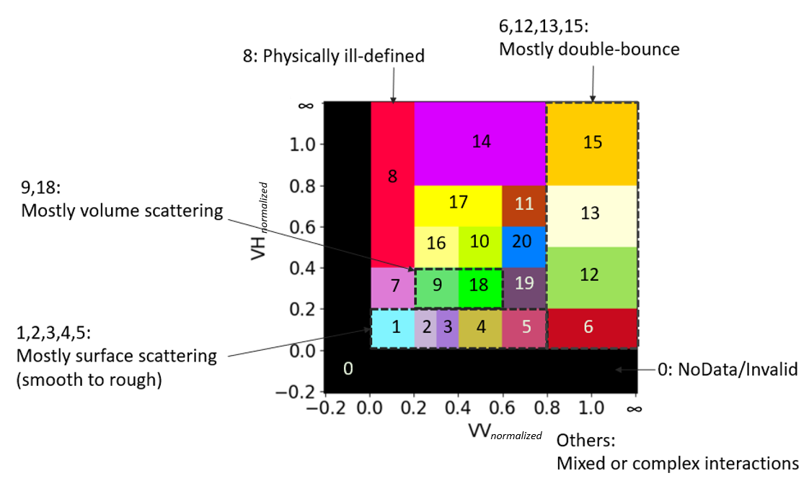
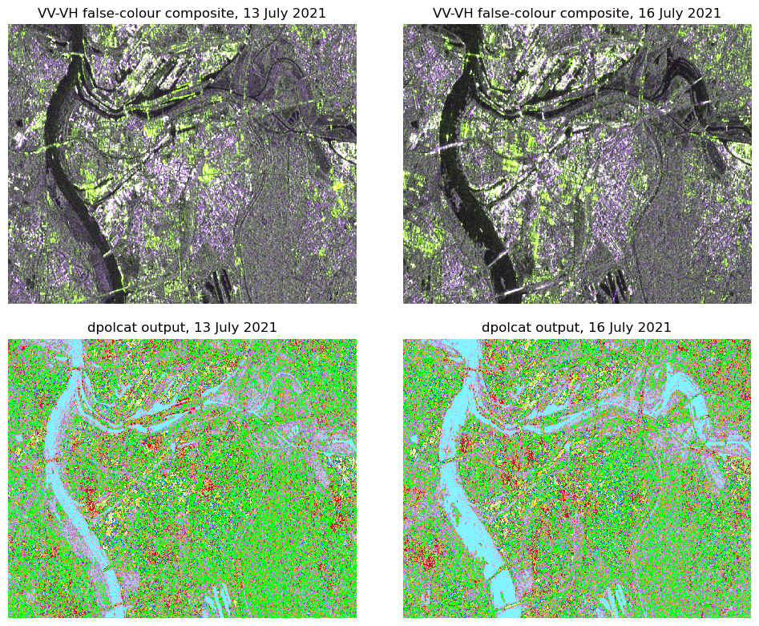

# Master's thesis

## Abstract (in short)

The [research group](https://www.plus.ac.at/geoinformatik/research/research-areas/eo-analytics/?lang=en) I've been part of since November 2021 has a project called [Sen2Cube](https://sen2cube.at) - this is a platform offering semantically enriched earth observation data cubes. Per the name, this focuses on Copernicus Sentinel-2 optical data. The *semantic enrichment* takes the form of spectral categories and indices that aim to make performing analyses human-friendly, i.e., convenient, understandable and explainable. Unfortunately, these analyses can be impeded by the presence of clouds and other atmospheric effects. The signals of the C-band (5.5cm wavelength) synthetic aperture radar (SAR) Sentinel-1 mission can pass through cloud and could complement well the existing optical data. However, this data can be challenging to work with, due, for instance, to geometric distortions, and its unintuitive interpretability. I explored some possible approaches for semantic enrichment of Sentinel-1 data that would make using this data more human-friendly. This was in the context of global Big Earth Data, which means such approaches need to be location-independent and fully automatable; supervised learning is not applicable, for instance.

## Main research questions

Sentinel-2 imagery semantically enriched with spectral-signature based categorization has been shown to be beneficial in a variety of downstream analysis tasks (see, e.g., Hartmann et al. 2023; Mandl and Lang 2023); is there a feasible, analogous approach for Sentinel-1 SAR data? How might this work in practice?

## Main outcomes
I devised an approach, *Polarimetric categories*, based on radiometric-terrain corrected backscatter amplitudes, and made a Python module for this: [dpolcat](https://github.com/lukesdm/dpolcat). This was presented at the [43rd EARSeL Symposium](https://manchester2024.earsel.org/) in June 2024, in Manchester, UK.

Polarimetric categories in the VV-VH plane:

Using *dpolcat* for visualization during flood mapping (Duisburg, Germany):

## References

Hartmann, Anja, Martin Sudmanns, Hannah Augustin, Andrea Baraldi, and Dirk Tiede. ‘Estimating the Temporal Heterogeneity of Mowing Events on Grassland for Haymilk-Production Using Sentinel-2 and Greenness-Index’. Smart Agricultural Technology 4 (1 August 2023): 100157. https://doi.org/10.1016/j.atech.2022.100157.

Mandl, Lisa, and Stefan Lang. ‘Uncovering Early Traces of Bark Beetle Induced Forest Stress via Semantically Enriched Sentinel-2 Data and Spectral Indices’. PFG – Journal of Photogrammetry, Remote Sensing and Geoinformation Science 91, no. 3 (1 June 2023): 211–31. https://doi.org/10.1007/s41064-023-00240-4.
