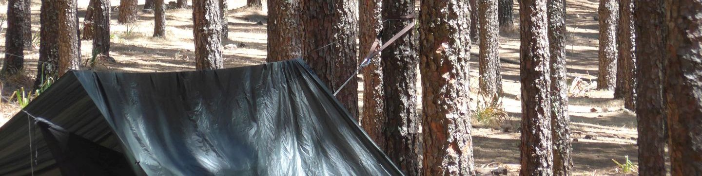
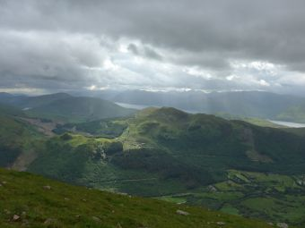
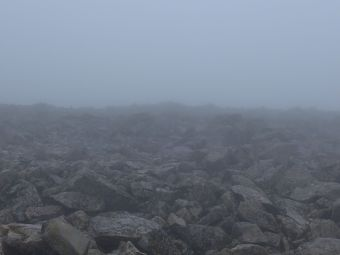
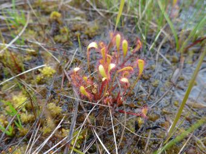
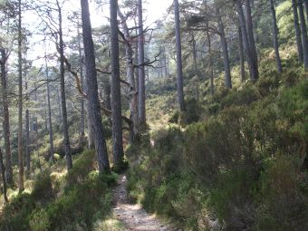
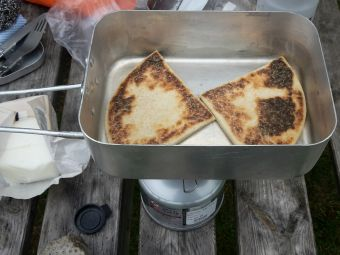
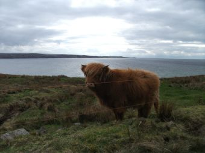
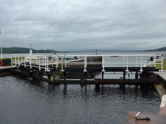
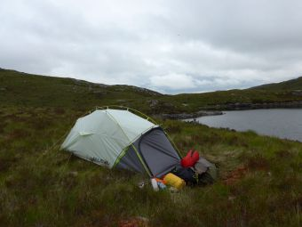

<!-- Header -->
<section class="align-center">
<header markdown="1">

# Highland Hammockery
  
Finding suitable camping spots using weighted overlay analysis

</header>

Luke McQuade, January 2022

📷 *Flag: "Scotland Grunge Flag" by Free Grunge Textures - www.freestock.ca, CC BY 2.0*  
*Banner: L. McQuade*

</section>

<!-- Introduction -->
<section class="wrapper style1 center">

## Introduction
Scotland, unlike the rest of the United Kingdom, offers the right to roam and wild camp across the country's open land (with a few [restrictions][R2R])). This makes it a good place for ad-hoc outdoor adventures.  

But, due to the rugged terrain and uneven ground, especially in the more rural areas, finding suitable camping spots is not always easy. Scotland does however, have the largest forest cover in the UK ([~18%, as of 2019][ForStrat]). Without detailed local knowledge, this makes the hammock the ideal choice for camping.

That said, not all woodland is suitable for hanging a hammock:
* Trees need to be a minimum of 15cm across to avoid damage, so younger woodland is to be avoided.
* A clear 2.5-3m between trees is needed. Coniferous plantations have the highest chance of guaranteeing this. Other forest types may have obstructing undergrowth, or may be too dense.
* A golden rule of hammocking is: Always look up before starting. Unhealthy trees and high winds are a dangerous combination. Coniferous plantations may offer a safer spot, due to the trees' smaller, lighter boughs. 
* Regardless of camping potential, active forestry operations are best avoided.

A region around the small, coastal city of Inverness in the Highlands is the focus of this investigation. The area features rolling hills, and encompasses the famous Loch Ness and the Caledonian canal as it meets the North Sea. Weighted overlay analysis is performed using the built-in tools of QGIS.  

<section markdown="1">

Typical Highland scenery.

*Ascending Ben Nevis*

</section>
<section>

Surfaces that are unaccommodating for tents can appear flat on all but the highest-resolution elevation models.

*Ben Nevis summit*

</section>
<section>

Likewise, wet ground can be problematic for tents.

*Sundew*

</section>
<section>

Ancient [Caledonian forest][CalFor] can be a tempting destination, but extra care has to be taken in this delicate environment.

</section>
<section>

Access to fresh supplies is always something to think about.  

</section>
<section>

Dangers from wildlife are minimal, [for now][Rewilding].  

</section>
<section>

The coastline of Scotland can be complex, so its not always obvious if water on the map is salt- or fresh-water in reality.  

</section>
<section>

TODO.  

</section>
<section>

After all that, there's still usually a place to pitch a tent by the end of the day.  

</section>

</section>

<section class="wrapper style1">

## Method

### Criteria

### Data

</section>

[R2R]: https://www.heraldscotland.com/news/19459239.right-roam-work-scotland-differ-england/
[ForStrat]: https://www.gov.scot/publications/scotlands-forestry-strategy-20192029/pages/4/
[CalFor]: https://www.wildlifetrusts.org/habitats/woodland/caledonian-forest
[Rewilding]: https://www.theguardian.com/environment/2021/sep/24/reintroducing-wolves-to-uk-could-hit-rewilding-support-expert-says